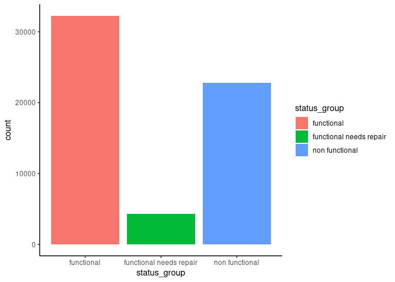

Untitled
================

## Load training data

``` r
X_train = fread('data/training-data.csv', stringsAsFactors = F)
y_train = fread('data/training-label.csv', stringsAsFactors = F)
```

## Output class distribution

``` r
ggplot(data = y_train) + 
  geom_bar(aes(x = status_group, fill = status_group)) +
  theme_classic()
```

<!-- -->

## Top 5 funder

``` r
top_5_funder <- X_train %>%
  group_by(funder) %>% 
  summarise(n = n()) %>% 
  arrange(desc(n)) %>% 
  head(5) %>% 
  ungroup() %>% 
  pull(funder)
```

    ## `summarise()` ungrouping output (override with `.groups` argument)

``` r
top_5_funder %>% 
  paste('Funder: ', ., collapse = '\n') %>% 
  cat(sep = '\n')
```

    ## Funder:  Government Of Tanzania
    ## Funder:  
    ## Funder:  Danida
    ## Funder:  Hesawa
    ## Funder:  Rwssp

``` r
data.frame('funder' = X_train$funder, 'status' = y_train$status_group, stringsAsFactors = F) %>% 
  #group_by(founder) %>% 
  #mutate(n = n()/nrow(X_train)) %>% 
  #arrange(desc(n)) %>% 
  #ungroup() %>% 
  #filter(n>0.025) %>% 
  #select(-n) %>% 
  filter(funder %in% top_5_funder) %>% 
  tabyl(var1 = funder, var2 = status, show_na = F, show_missing_levels = F) %>% 
  adorn_percentages("all") %>%
  adorn_rounding(2) %>% 
  adorn_ns()
```

    ##                  funder  functional functional needs repair non functional
    ##                         0.10 (1981)              0.02 (437)    0.06 (1217)
    ##                  Danida 0.09 (1713)              0.01 (159)    0.06 (1242)
    ##  Government Of Tanzania 0.19 (3720)              0.04 (701)    0.24 (4663)
    ##                  Hesawa 0.05  (936)              0.01 (232)    0.05 (1034)
    ##                   Rwssp 0.04  (805)              0.01 (109)    0.02  (460)

## Na values

``` r
na_values <- is.na(X_train) %>% colSums() 
data.frame(na_values) %>% filter(na_values > 0)
```

    ##                na_values
    ## public_meeting      3334
    ## permit              3056

``` python
from sklearn.tree import DecisionTreeClassifier

dt = DecisionTreeClassifier()

dt
```

    ## DecisionTreeClassifier()
